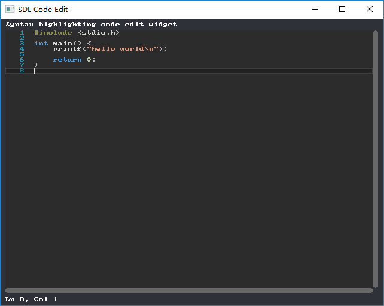

## SDL Code Edit

Syntax highlighting code edit widget in `SDL`

This is a simple widget that provides source code editing functionality with basic syntax highlighting. Based on [BalazsJako/ImGuiColorTextEdit](https://github.com/BalazsJako/ImGuiColorTextEdit). Modified with some changes and improvements. I used the `SDL gfx` library for primitive rendering including colored rectangles, line numbers, code marks, and the code text itself. You can replace it with other font rasterizer for specific appearance.

### Main features

 - Implements typical code editor look and feel
 - Essential mouse and keyboard work support
 - Indent/unindent support, by Tab/Shift+Tab
 - Undo/redo support
 - Merging for similar redo/undo records
 - Extensible, multiple language syntax support
 - Case-insensitive language support
 - Color palette support; you can switch between different color palettes, or even define your own
 - Exception for multi-line comment
 - Error markers; the caller can specify a list of error messages together the line of occurence, the editor will highligh the lines
 - Code lines indications of modification
 - Large file support; there is no explicit limit set on file size or number of lines, performance is not affected when large files are loaded (except syntax coloring, see below)

### How to use

The repository contains a Visual Studio solution for Windows. If you were setting up for other platforms or integrating into your own projects:

 - Copy both `code_edit.h` and `code_edit.cpp` in the `/sdl_code_edit` directory to your target
 - Copy the `sdl_gfx` library as well for default build
 - See `main.cpp` for usage

### Known issues

 - Tooltip is not yet implemented
 - Syntax highligthing is based on `std::regex`, which is diasppointingly slow. Because of that, the highlighting process is amortized between multiple frames. Hand-written colorizers and/or a lexical scanner might help resolve this problem
 - No variable-width font support
 - There's no built-in find/replace support, however it won't be difficult to make it with combination of existing functions
